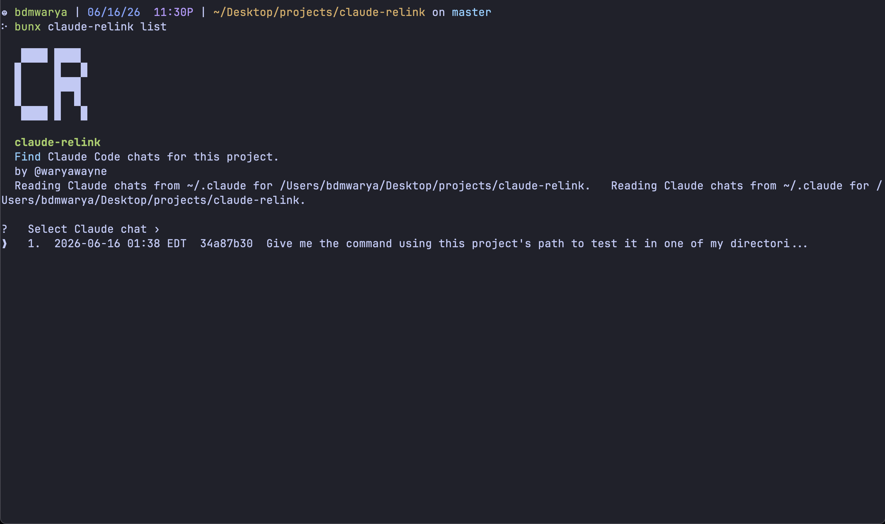

# claude-relink



`claude-relink` is a small read-only helper for finding missing or hard-to-locate Claude Code chats that match the current working directory and printing the command needed to resume them.

Use it when a Claude Code chat looks lost, missing from the `/resume` picker, or disconnected from the project you were working in, but the local Claude Code transcript still exists on disk.

This is especially for chats that no longer appear in the Claude Code `/resume` picker after you ran `/clear` or `/new`. Those commands do not delete the transcript — the `.jsonl` file stays on disk untouched. They just start a fresh session id, and the picker stops surfacing the old one. Run `claude-relink latest` or `claude-relink list` from the project directory, and it reads the project folder directly and ignores whatever the picker decided to show.

It reads local Claude Code storage:

- `~/.claude/projects/<encoded-cwd>/<session-id>.jsonl`

There is no database. Each session is a plain JSONL transcript, and the session id is the file name. The working directory it matches against is read from inside each transcript (the folder name is lossy and is not trusted), so it still finds chats whose project path contains a `.` directory such as `~/.t3/worktrees/...`.

It does not edit, move, or delete anything under `~/.claude`. It only reads transcripts and their modification times.

## Using the Codex CLI?

If you use the Codex CLI instead of Claude Code, there is a companion tool, `codex-relink`, that solves this same problem for Codex chats — finding missing or hard-to-locate sessions that match the current working directory and printing the command needed to resume them.

It uses the same commands and usage as `claude-relink`. Install it globally:

```bash
npm install --global codex-relink
```

Then run it from the project directory whose Codex chats you want to find:

```bash
codex-relink latest
codex-relink list
```

Or run it without installing anything globally:

```bash
npx codex-relink latest
bunx codex-relink latest
```

## Install

Install it globally from npm if you want the `claude-relink` command available everywhere:

```bash
npm install --global claude-relink
```

Then run it from the project directory whose Claude Code chats you want to find:

```bash
claude-relink latest
claude-relink list
```

You can also run it without installing anything globally:

```bash
npx claude-relink latest
npx claude-relink list
```

Or with Bun:

```bash
bunx claude-relink latest
bunx claude-relink list
```

All three forms use the current working directory as the project to match against local Claude Code storage.

## Build

```bash
pnpm install
pnpm build
```

## Latest Chat

From any project directory:

```bash
claude-relink latest
```

Or from this checkout without installing:

```bash
node dist/cli.js latest
```

The command finds Claude Code chats matching `process.cwd()`, selects the newest chat by transcript modification time, and prints:

```text
  Copy the command below to resume your chat:

  claude --resume <session-id>
```

If there are no matching chats, it prints a short message for the current directory.

## Pick A Chat

From any project directory:

```bash
claude-relink list
```

Or from this checkout without installing:

```bash
node dist/cli.js list
```

`list` shows an interactive picker, newest first. Rows are numbered so `1` is always the latest matching chat, and the picker stops at the oldest chat instead of wrapping around. Each row includes the number, updated time, short session id, and title or fallback. Press enter to select the highlighted chat. After selection, the accepted prompt line shows `Chosen ID: <short-id>` before it prints:

```text
  Copy the command below to resume your chat:

  claude --resume <session-id>
```

## Options

Show CLI help:

```bash
claude-relink -h
claude-relink --help
```

Use `--claude-home` when testing against another Claude home directory:

```bash
claude-relink --claude-home /tmp/claude-home latest
```

Normal use does not require any path flags; the current working directory is used automatically.

## Author

Built by Warya Wayne, `@waryawayne`.

- GitHub: [@WaryaWayne](https://github.com/WaryaWayne)
- X: [@waryawayne](https://x.com/waryawayne)
